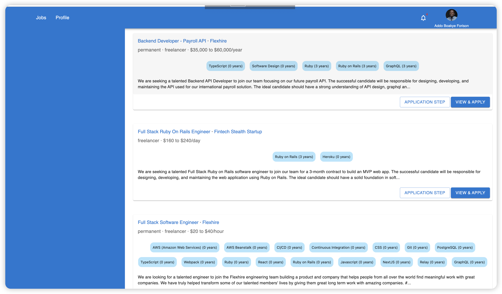
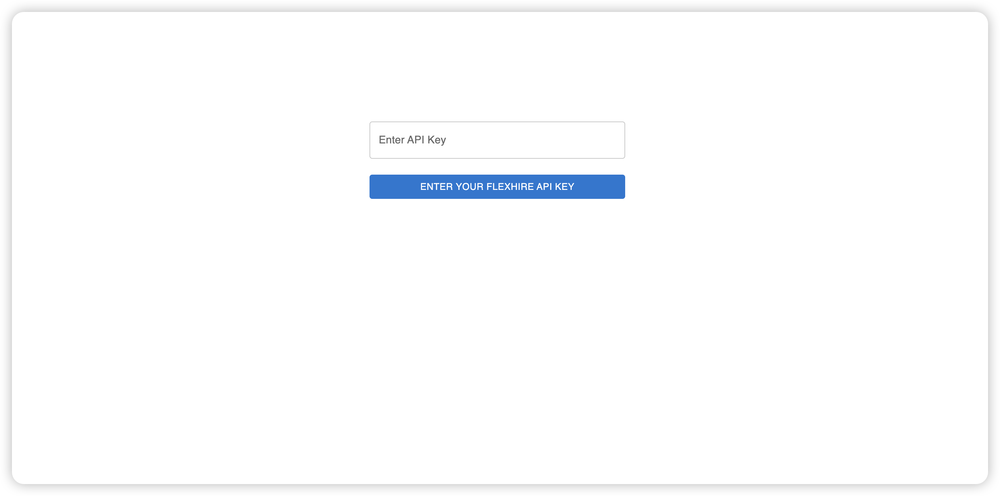

# Appollo Graphql solution

This project contains solution about building and consuming data from a graphql enpoint

## Description

This is a small project that demonstrates how to make a graphql queries using appolloClient api to get information from a graphql enpoint.
In this project, before users can acces the full application, users need to have an api key from flexhire. The api key is going to be an authentication source for the users to have access to the website. The website shows information about myself vis-a-vis the information I have provided on Flexhire.





## Technologies

- React
- TypeScript
- Material UI
- AppolloClient
- Bootstrap
- GraphQL endpoint

## Features
render my profile and job opportunities associated with my profile

## Usage
This project has not been deployed to production, hence can be used by setting it up locally.

> Clone the repository to your local machine

```sh
$ git https://github.com/Forison/flexhire-front-end
```
> cd into the directory

```sh
$ git checkout Appollo-graphql
```

get endpoint and apikey from Flexhire

```sh
$ npm install
```

```sh
$ npm start
```

## Designed and developed by

[Boakye Addo Forison](https://github.com/Forison)

## Contact

[LinkedIn](https://www.linkedin.com/in/forison/)

## Contributing

1. Fork it (https://github.com/Forison/calculator/)
2. Create your feature branch (git checkout -b feature/[choose-a-name])
3. Commit your changes (git commit -am 'What this commit will fix/add')
4. Push to the branch (git push origin feature/[chosen name])
5. Create a new Pull Request