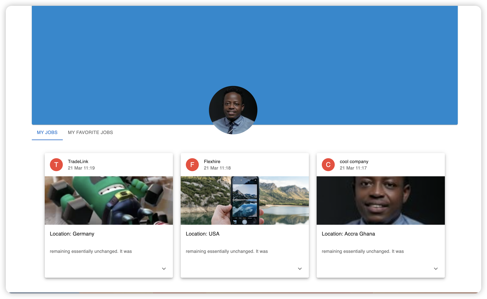
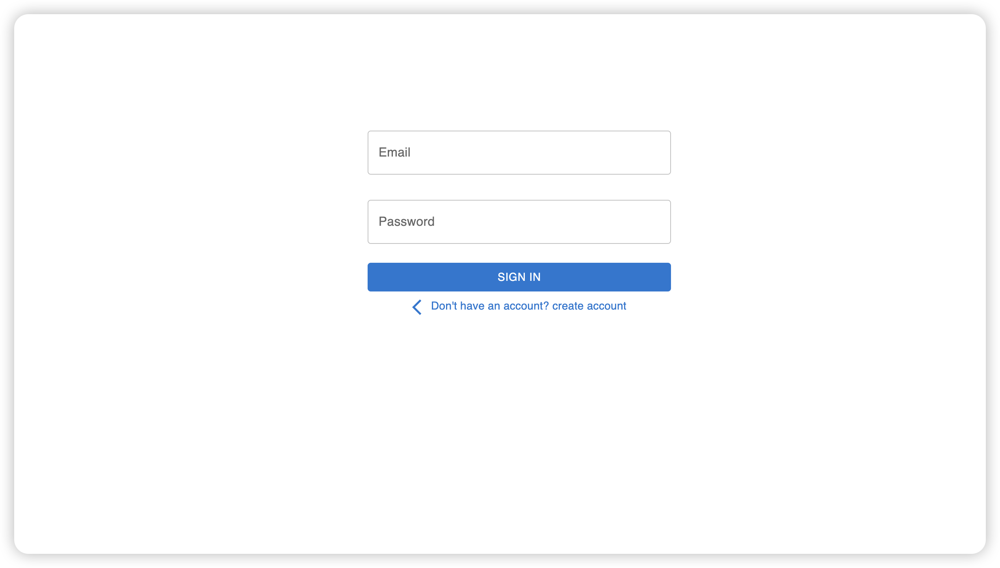
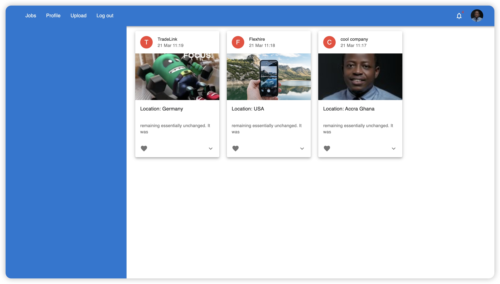

# RESTFUL API solution

This project contains solution about building and consuming data from a REST API endpoint

## Description

This is a front-end application which relies on (this)[https://github.com/Forison/back-end] backend API. The backend API contains logic which enables use to create account, login, logout, upload, jobs, like uploaded jobs, view profile, view liked jobs and view jobs which were uploaded by the user.







## Technologies

- React
- TypeScript
- Material UI
- REST API
- Bootstrap

## Usage
This project has not been deployed to production, hence can be used by setting it up locally.

> Clone the repository to your local machine

```sh
$ git https://github.com/Forison/flexhire-front-end
```
> cd into the directory

```sh
$ git checkout restful-api
```

```sh
$ yarn install
```

```sh
$ git clone https://github.com/Forison/back-end
```

```sh
$ bundle install
```

```sh
$ rails s
```

```sh
Start the front-end application by running

$ yarn start
```
## Designed and developed by

[Boakye Addo Forison](https://github.com/Forison)

## Contact

[LinkedIn](https://www.linkedin.com/in/forison/)

## Contributing

1. Fork it (https://github.com/Forison/calculator/)
2. Create your feature branch (git checkout -b feature/[choose-a-name])
3. Commit your changes (git commit -am 'What this commit will fix/add')
4. Push to the branch (git push origin feature/[chosen name])
5. Create a new Pull Request